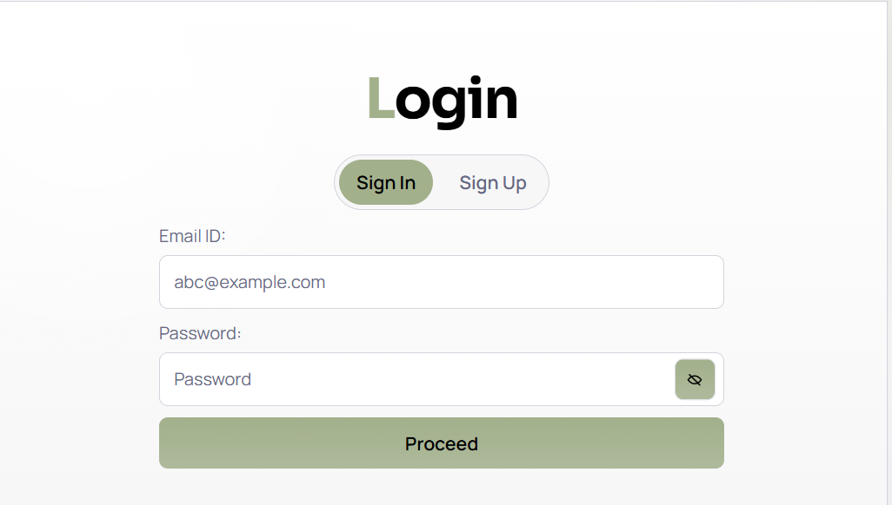
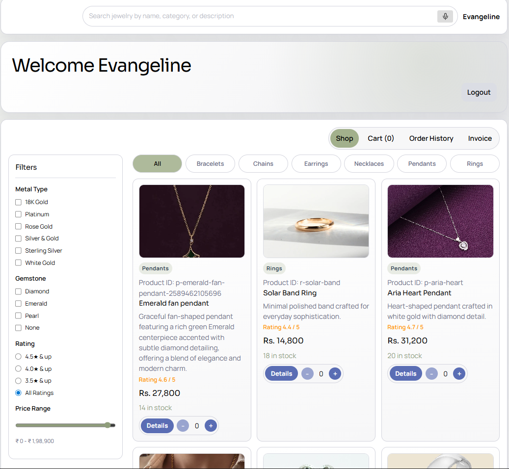
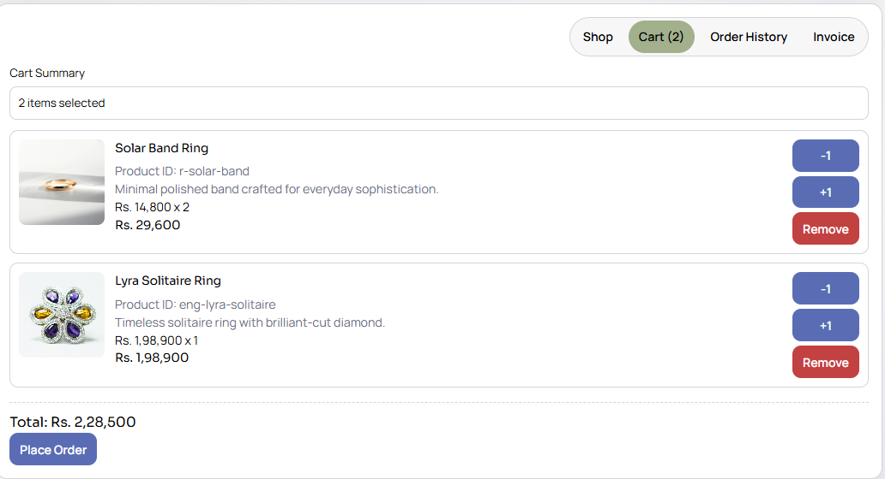
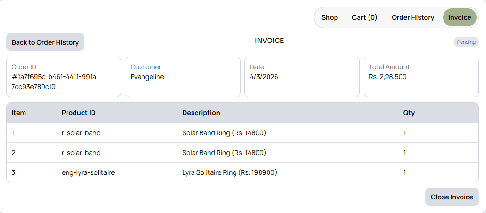
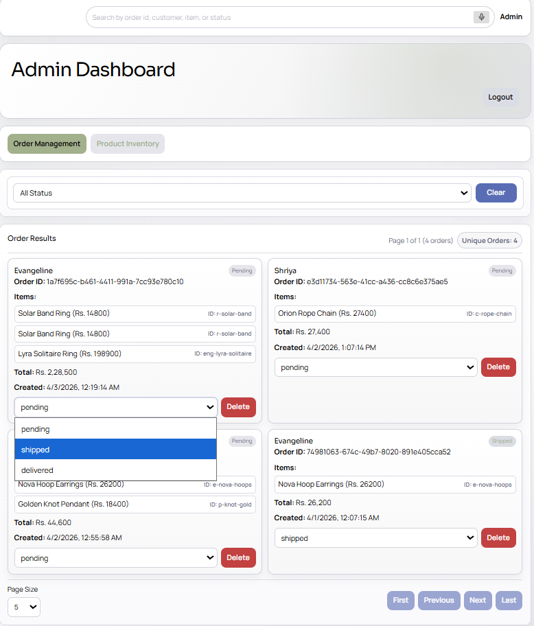
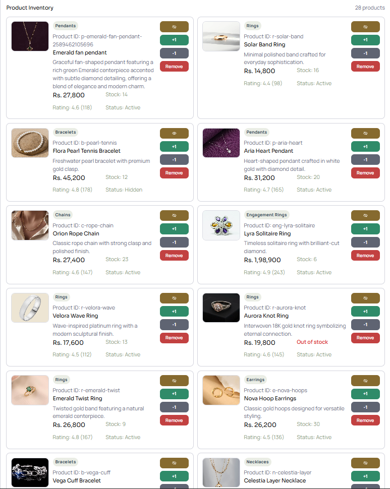

# Order Management System

Full-stack order management app with FastAPI, React, and PostgreSQL.

## Key Features

- User sign up/sign in with customer and admin roles
- Product catalog with search, filters, stock updates, and admin CRUD
- Cart persistence by user email
- Order creation, status updates, delete, search, and pagination
- Order history and invoice view
- Voice input support in admin product form

## Demo Screenshots

<table>
	<tr>
		<td align="center"><strong>Login View</strong><br></td>
		<td align="center"><strong>Customer Dashboard</strong><br></td>
	</tr>
	<tr>
		<td align="center"><strong>Cart View</strong><br></td>
		<td align="center"><strong>Invoice View</strong><br></td>
	</tr>
	<tr>
		<td align="center"><strong>Admin Order Management</strong><br></td>
		<td align="center"><strong>Product Inventory</strong><br></td>
	</tr>
</table>

## Tech Stack

- Backend: FastAPI, SQLAlchemy, Pydantic, psycopg, Uvicorn
- Frontend: React, Vite, Axios, React Toastify
- Database: PostgreSQL (Neon-compatible)

## API Endpoints

- Auth: `POST /auth/signup`, `POST /auth/signin`
- Products: `POST /products`, `GET /products`, `GET /products/search`, `GET /products/{product_id}`, `PATCH /products/{product_id}`, `DELETE /products/{product_id}`, `PATCH /products/{product_id}/stock`
- Cart: `POST /cart`, `GET /cart?email=...`
- Orders: `POST /orders`, `GET /orders`, `GET /orders/count`, `GET /orders/search`, `GET /orders/by-user?email=...`, `GET /orders/{order_id}`, `PATCH /orders/{order_id}`, `DELETE /orders/{order_id}`

## Quick Start

1. Clone repository.

```bash
git clone https://github.com/EvangelineM/order_management_system/
cd order_managment
```

2. Start backend.

Create `backend/.env`:

```bash
DATABASE_URL=postgresql+psycopg://<user>:<password>@<host>/<db>?sslmode=require
```

```bash
cd backend
python -m venv .venv
source .venv/Scripts/activate
pip install -r requirements.txt
uvicorn main:app --reload
```

3. Start frontend.

Create `frontend/.env`:

```bash
VITE_API_BASE_URL=http://127.0.0.1:8000
```

```bash
cd ../frontend
npm install
npm run dev
```

- Backend URL: `http://127.0.0.1:8000`
- Frontend URL: `http://localhost:5173`

## Default Admin Login

- Email: `admin@gmail.com`
- Password: `admin123`

Change default credentials before production use.

## Environment Variables

- Backend: `DATABASE_URL` (required)
- Frontend: `VITE_API_BASE_URL` (optional)
